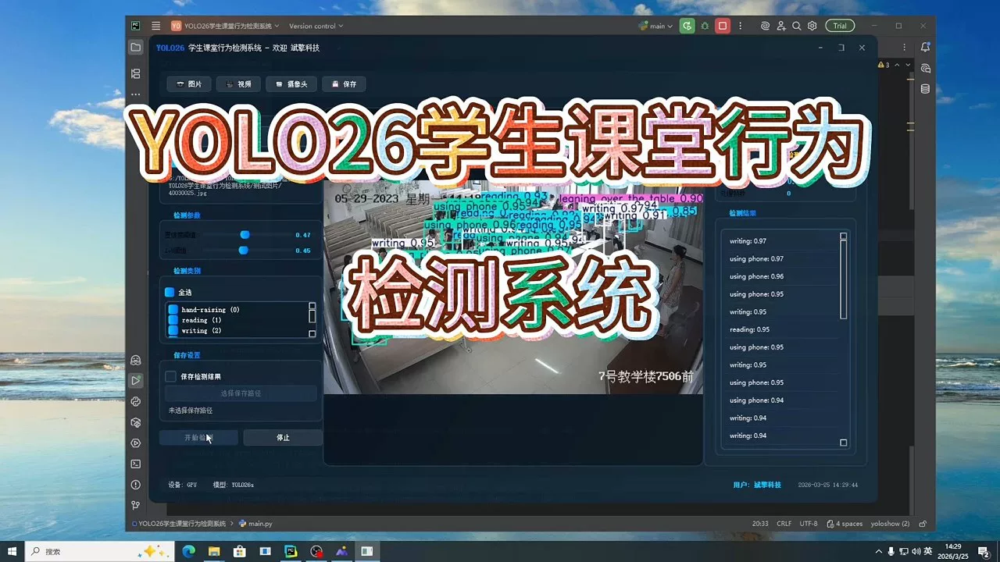
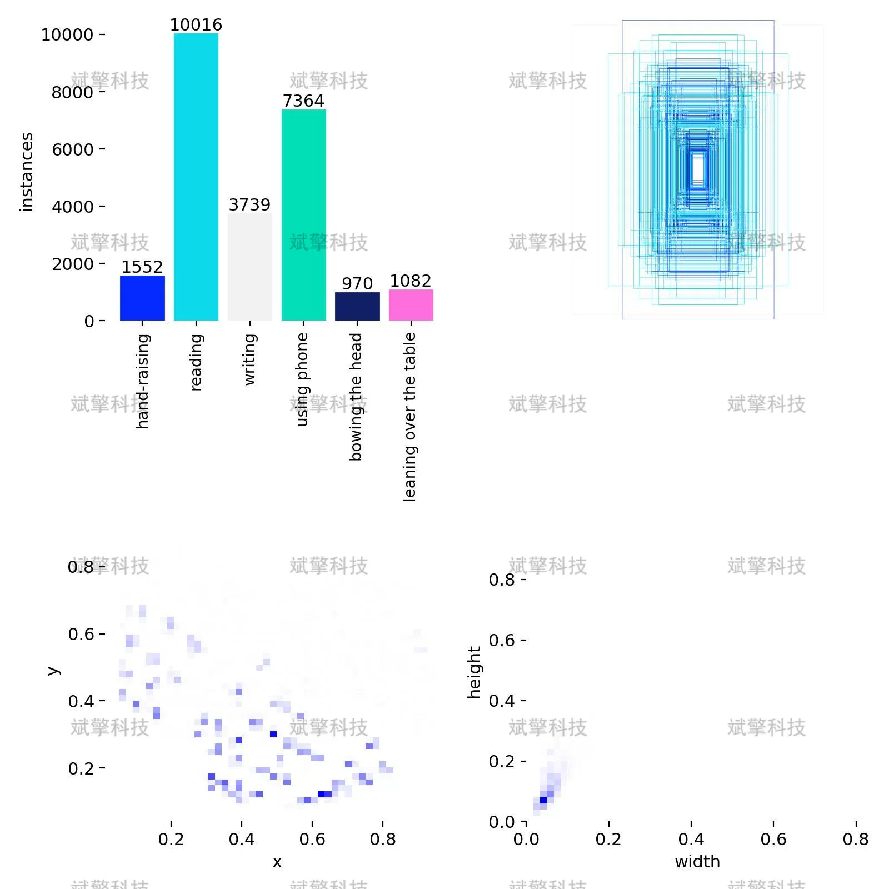
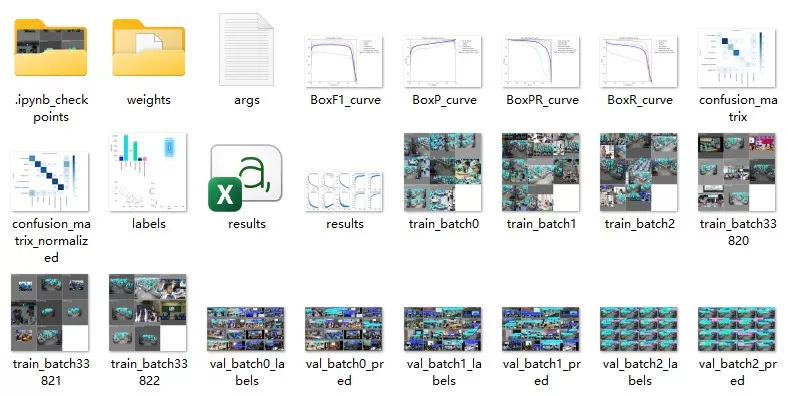
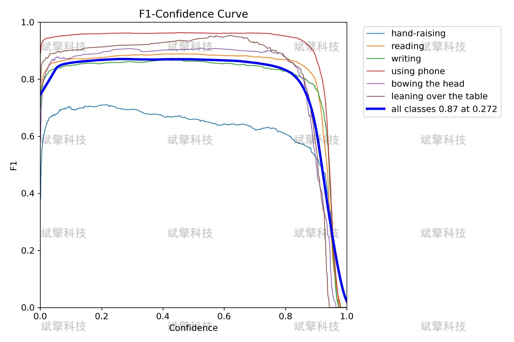
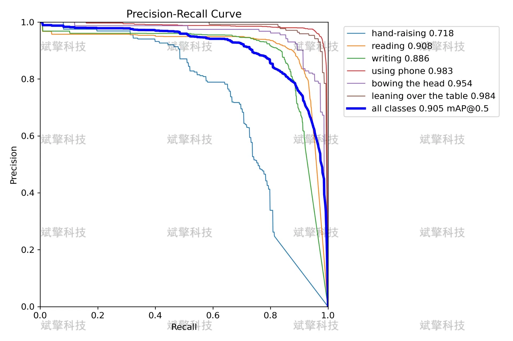
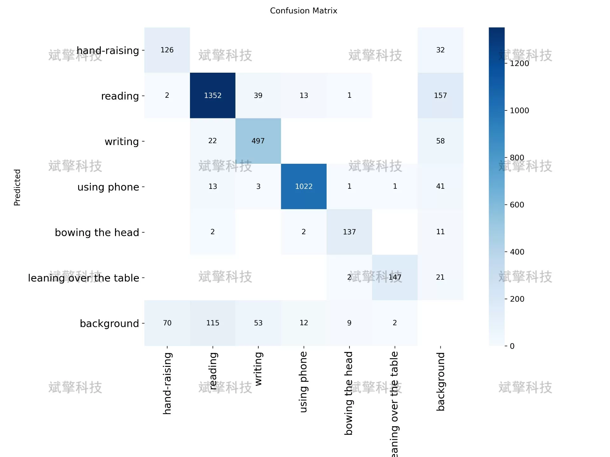
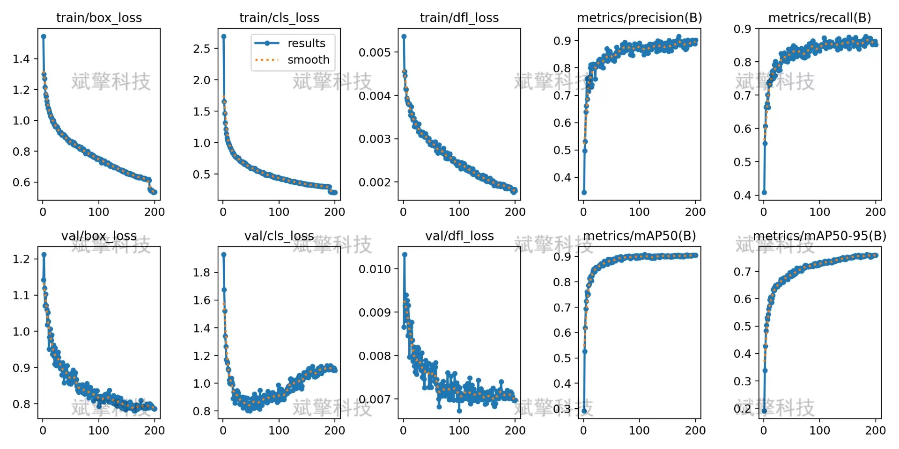
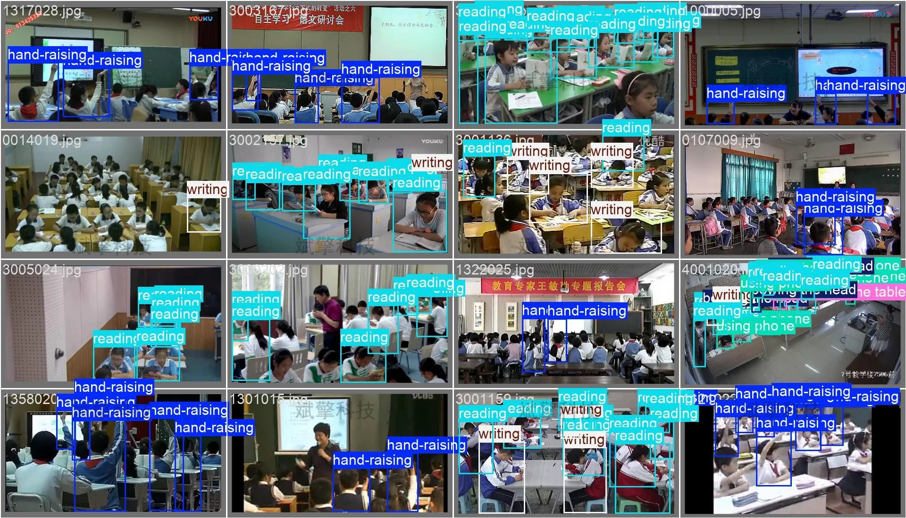
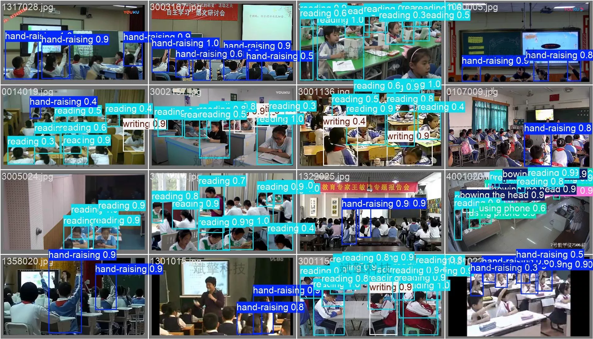

# YOLO26 Student Classroom Behavior Detection System | Source Code

## Body

YOLO26 Student Classroom Behavior Detection System | Source Code: YOLO26 Student Classroom Behavior Detection: mAP of 0.905 for 6 Classes, with the Most Accurate Recognition for Using Mobile Phones and Lying on the Desk

Student classroom behavior detection is a key task in intelligent education monitoring systems, playing a significant role in teaching quality assessment, student attention analysis, and classroom management. This study builds a detection system based on the YOLO26 object detection algorithm, covering six common classroom behaviors (raise hand, read, write, use mobile phone, bow head, lie on the desk). The experimental dataset includes 1422 training images, 203 validation images, and 407 test images.
The experimental results show that the average precision (mAP@0.5) of this system reaches 0.905 under an IoU=0.5 threshold, with F1 scores for "using mobile phone" and "lying on the desk" close to 0.97, demonstrating superior performance. A confusion matrix analysis reveals some confusion between "reading" and "writing," while "raise hand" has a 35% chance of being misidentified as background, indicating there is still room for improvement in feature extraction for this category. This study validates the effectiveness of YOLO26 in student classroom behavior detection tasks, providing a reference for the development of subsequent intelligent classroom monitoring systems.

The dataset contains six types of student classroom behaviors:
Raise hand (hand-raising): Student raises one or both arms to ask questions or answer questions
Reading (reading): Student gazes at the book or reading material
Writing (writing): Student writes on paper or notebook with a pen
Using mobile phone (using phone): Student holds a mobile phone or looks down at the screen of the phone
Bow head (bowing the head): Student bows their head but not using a mobile phone, possibly thinking or tired
Leaning over the table (leaning over the table): Student's head rests on the tabletop, often indicating fatigue or distraction

The classroom behavior dataset used in this study contains 2032 labeled images, divided into training set, validation set, and test set at a ratio of about 7:1:2 as follows:
Training set: 1422 images
Validation set: 203 images
Test set: 407 images

Free reservation for remote installation. Unsuccessful refund upon failure.
Purchase Enjoy the following resources (including Baidu Cloud automatically unlocked):
YOLO recognition detection project complete source code
YOLO format dataset
Training code + UI interface code
Trained model + result images
Software installer
Add WeChat for remote installation (automatically displayed after purchase) - Unsuccessful, full refund

⚙️ Core function modules
Detection capabilities
Image detection: Upon upload, returns detection boxes + category information
Video detection: Supports video files, analyzes frames accurately
Camera real-time detection: Connects USB camera for dynamic monitoring
Interaction and control
Target selection: Choose one or more categories for detection
Parameter real-time adjustment: Adjustable confidence threshold & IoU threshold, flexible control accuracy
Result saving: Save images/videos/camera detection results in one click
System and data
User login registration: Supports password strength checking + encryption storage
Log recording: Records operation and error information (timestamped)

## Images

## Payment

Here is a pay link on Stripe ( https://buy.stripe.com/3cs8yP7sY87d0vu9AB ). Please contact me lonlonago@foxmail.com after funding $89, and I will send you a complete data files , thank you!

